# App Final Project con MERNG

_Una app para la social media. Ideal para personas que quieren subir una foto y comentario algo. Puedes revisar la app web_

## Comenzando 🚀

_Estas instrucciones te permitirán obtener una copia del proyecto en funcionamiento en tu máquina local para propósitos de desarrollo y pruebas._

## Primer repositorio clonado
```
  $ git clone https://github.com/dghojas/FinalProject-GraphQL.git
  $ cd FinalProject-GraphQL
```

## Ejecutar backend (server) 📦
```
  $ cd server
  $ npm install o npm i || yarn
  $ npm run start || yarn start
```

## Ejecutar frontend (client) 📦
```
  $ cd client
  $ npm install o npm i || yarn
  $ npm run start || yarn start
```

## Uso de 🛠️

### Server
```
  - Apollo Server
  - Apollo Server Express
  - BodyParser
  - Cloudinary
  - Cors
  - DotEnv
  - Express
  - Firebase Admin
  - GraphQL
  - GraphQL Scalars
  - GraphQL Tools
  - Mongoose
  - ShortId
```

### Client
```
  - React
  - Apollo/React-Hooks
  - Apollo Boost
  - Axios
  - Firebase
  - GraphQL
  - OmitDeep
  - React Image File Resizer
  - React Router Dom
  - React Toastify
```

## Capturas de pantalla después de que se ejecutó la acción en GraphQL (solo algunos ejemplos):

No olvides agregar el auth token:

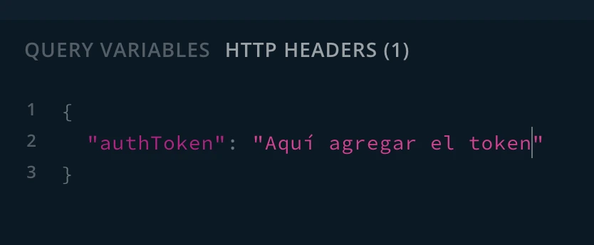

Create a User:

 - EndPoint: userCreate
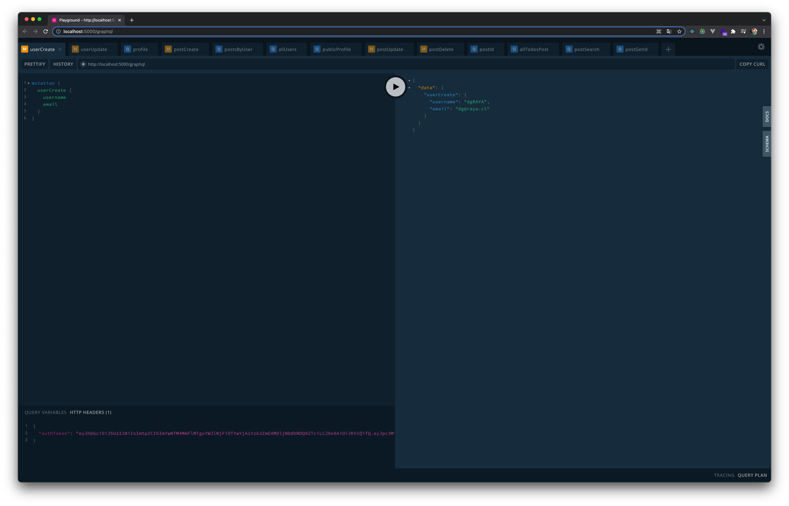

Update a User:

 - EndPoint: userUpdate
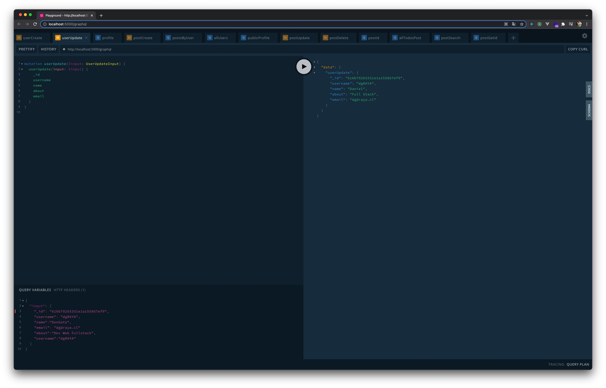

Show my profile:

 - EndPoint: profile


Create a Post:

 - EndPoint: postCreate
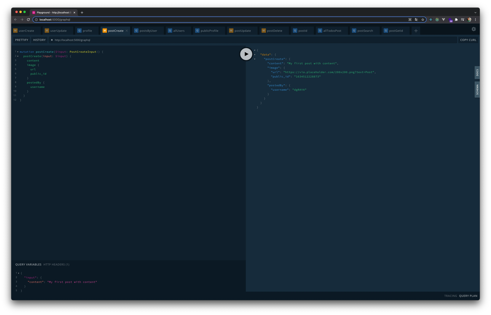

Only show post in my user:

 - EndPoint: postsByUser
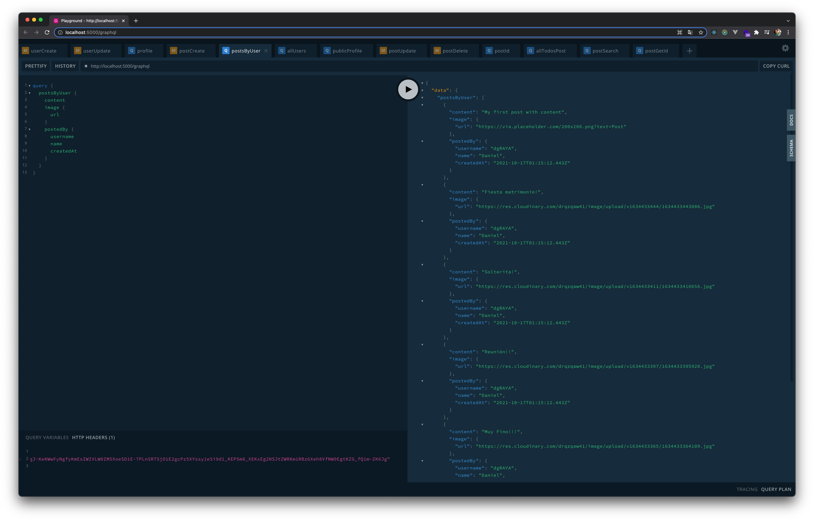

List all users:

 - EndPoint: allUsers
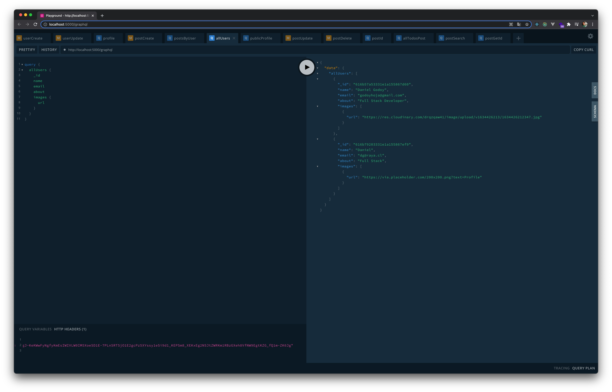

Public profile:

 - EndPoint: publicProfile
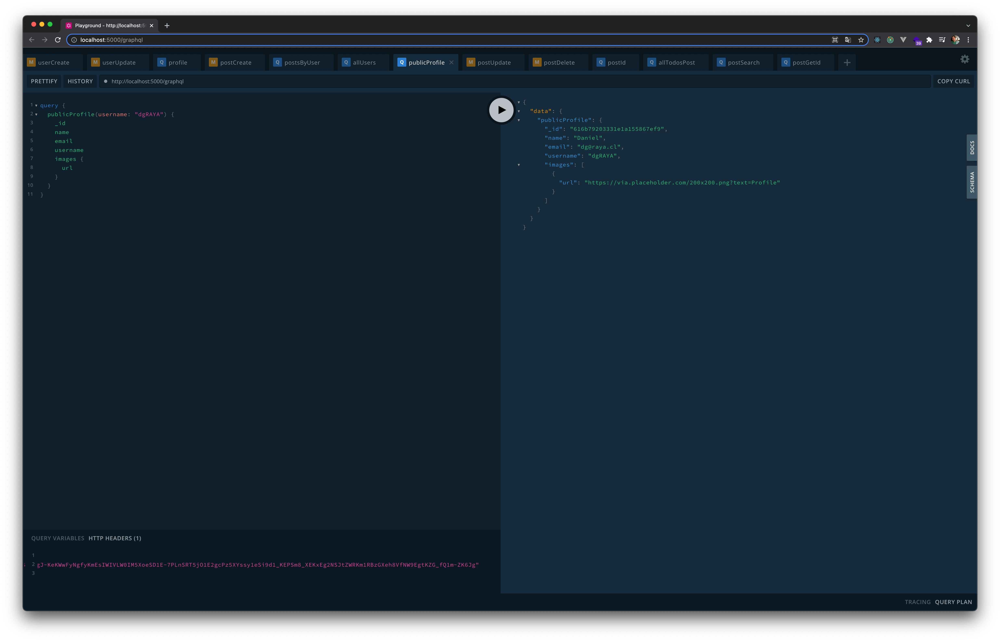

Update a post:

 - EndPoint: postUpdate
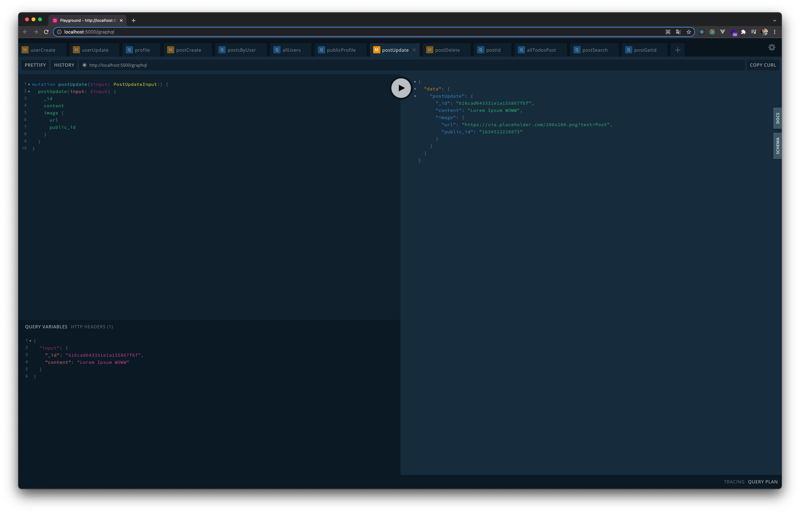

Delete a post:

 - EndPoint: postDelete
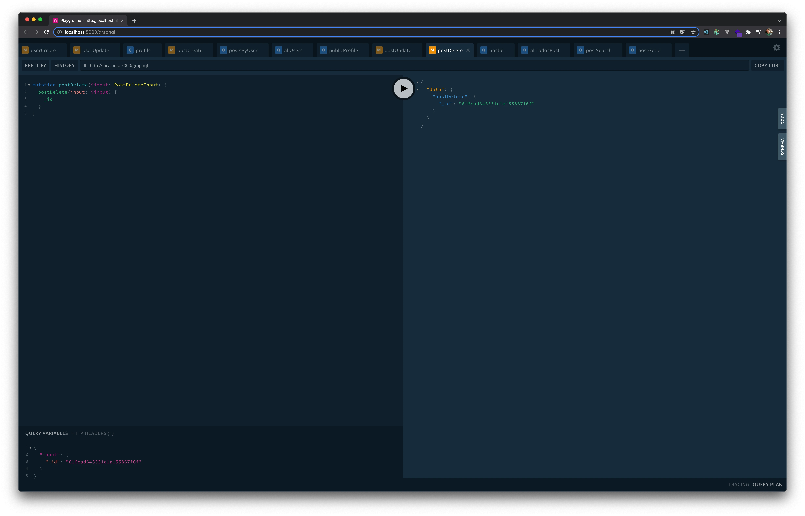

Get Id a post:

 - EndPoint: postGetId
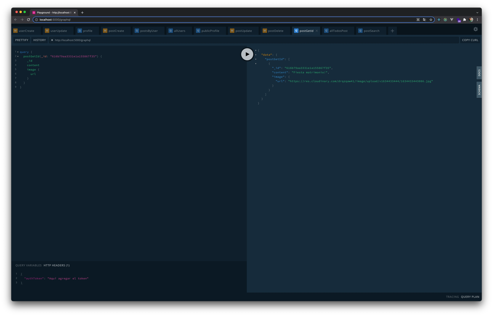

List all post and pagination (Offset and Limit):

 - EndPoint: allTodosPost
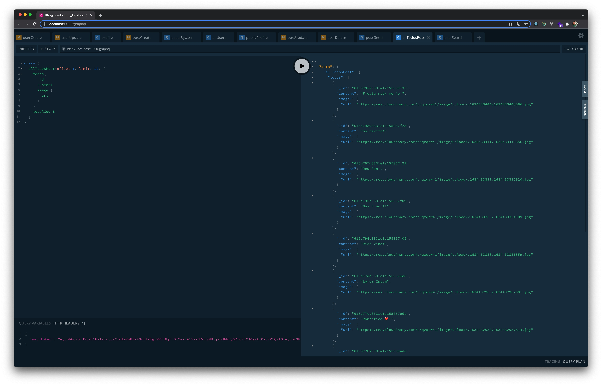

Search a post:

 - EndPoint: postSearch


## Autores ✒️

- **Daniel Godoy Hojas 🍃** - [dghojas](https://github.com/dghojas)